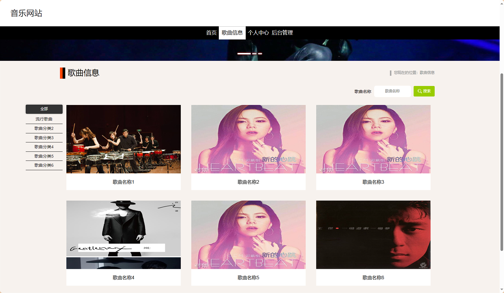
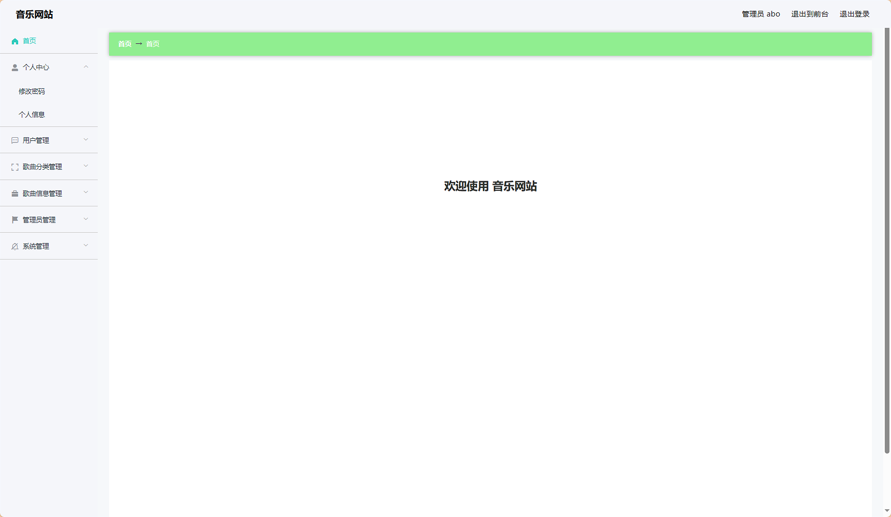

# springboot-基于web的音乐网站 / springboot-Web-based_Music_Platform


> 更多毕设项目可跳转至项目导航栏检索：[毕设项目](http://sysadmin.3vfree.vip)，需要联系博主v：xq-lucky311，q：1047944234

## 项目简介  
基于 SpringBoot 2.7+ 的全栈式音乐管理系统，整合 MyBatis-Plus 数据持久层与 Shiro 安全框架，实现歌曲管理、在线试听、用户权限控制等核心功能，采用 B/S 架构支撑高并发访问。

## 特征介绍  
- **权限体系**：集成 Apache Shiro 实现管理员/用户分级权限控制，支持动态路由拦截。  
- **高效ORM**：MyBatis-Plus 增强 CRUD 操作，自动生成 DAO 层映射文件。  
- **文件管理**：内置 Commons-IO 实现 MP3/视频文件上传下载，支持百度云 SDK 集成。  
- **模块化架构**：实体层分离 model/view/vo 多维度数据模型，适配复杂业务场景。  
- **工具集成**：采用 Hutool 工具包处理加密(MD5Util)、HTTP 请求(HttpClientUtils)等通用功能。  

---

## 代码结构 
```
src/
├── main/
│   ├── java/
│   │   ├── com/
│   │   │   ├── annotation/          # 权限注解
│   │   │   │   ├── LoginUser.java
│   │   │   ├── config/              # 全局配置
│   │   │   │   ├── MybatisPlusConfig.java
│   │   │   ├── controller/          # 接口层
│   │   │   │   ├── GequxinxiController.java
│   │   │   │   ├── GequfenleiController.java
│   │   │   ├── dao/                 # 数据访问层
│   │   │   │   ├── GequxinxiDao.java
│   │   │   ├── entity/              # 持久化实体
│   │   │   │   ├── model/           # 业务模型
│   │   │   │   ├── view/            # 视图模型  
│   │   │   │   ├── vo/              # 传输对象
│   │   │   ├── interceptor/         # 请求拦截
│   │   │   │   ├── AuthorizationInterceptor.java
│   │   │   ├── service/             # 服务层
│   │   │   │   ├── impl/            # 服务实现
│   │   │   │   │   ├── GequxinxiServiceImpl.java
│   │   │   ├── utils/               # 工具类
│   │   │   │   ├── FileUtil.java    # 文件处理
│   ├── resources/
│   │   ├── mapper/                  # MyBatis映射
│   │   │   ├── GequxinxiDao.xml
│   │   ├── application.yml          # 主配置
│   │   ├── static/                  # 静态资源
│   │   │   ├── upload/              # 文件存储

---
```
## 使用说明
1. 配置数据库：修改 application.yml 中 MySQL 连接信息
2. 启动服务：运行 SpringbootSchemaApplication.java
3. 访问后台：http://localhost:8080/springboote2a78/admin/dist/index.html (账号: abo/abo)
4. 访问前台：http://localhost:8080/springboote2a78/front/index.html
5. 文件上传：FileController 处理 /upload 接口，存储至 static/upload 目录

浏览器要求：谷歌浏览器（Chrome 85+）
```

# 项目实际截图：

## 前台：





## 后台：



> 等等...

# 精选项目导航 & 快速部署工具
## 项目资源一站直达
- ​**访问项目导航站**：[点击进入](http://sysadmin.3vfree.vip)**快速检索所需项目名称**
- ​**技术栈全覆盖**：Java/SSm/Spring Boot/小程序等主流技术方案
- ​**配套资源**：每个项目均提供部署文档 + 演示视频（附效果截图）

### ▌导航站预览


### ▌工具界面预览


## 捐赠
> 博主将持续更新Java全栈开发项目，包含ssm，springboot，前后端分离系统等项目。
> 此外如果您够宽裕，请博主喝杯咖啡吧！捐赠将用于服务器维护与开源社区建设，感谢您的认可！
> 如需更多Java相关项目毕设3000+，有其他项目需求，sql文件等可联系博主v:xq-lucky311

---